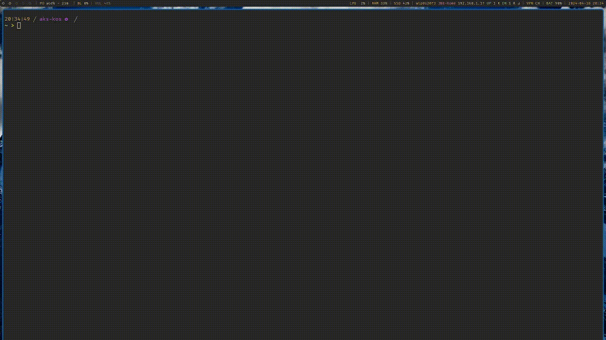
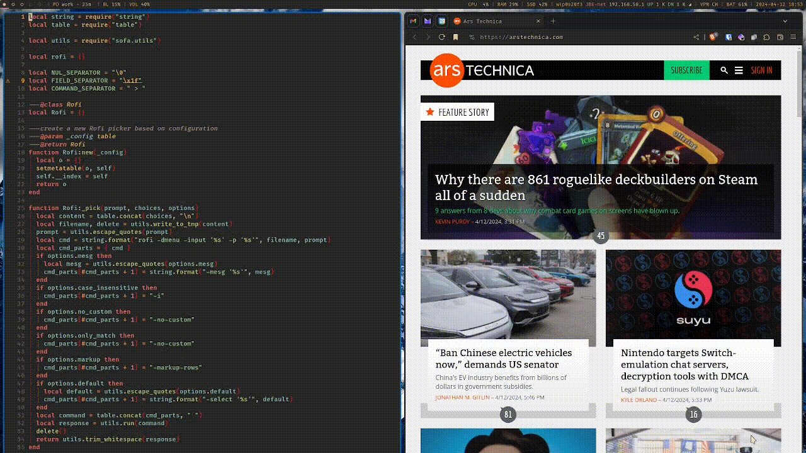
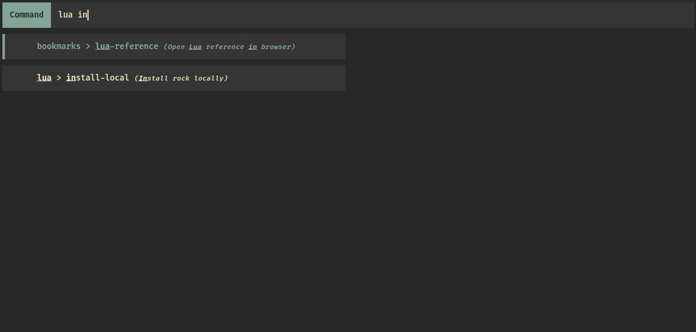
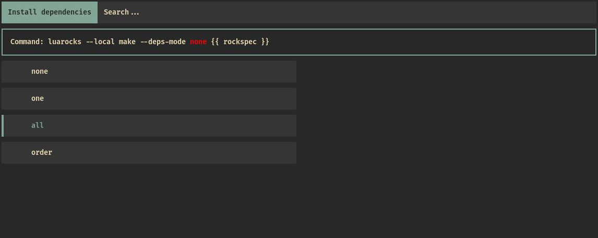

# sofa


A command execution engine powered by [`rofi`](https://github.com/davatorium/rofi).

---

**Table of Contents:**

<!--toc:start-->
- [sofa](#sofa)
  - [Examples](#examples)
    - [For Snippets Management](#for-snippets-management)
    - [For Dynamic Bookmarks](#for-dynamic-bookmarks)
    - [Features Preview](#features-preview)
  - [Installation](#installation)
  - [Integration](#integration)
    - [Bash](#bash)
    - [Zsh](#zsh)
    - [Fish](#fish)
  - [Configuration](#configuration)
  - [Development](#development)
    - [Testing](#testing)
  - [Roadmap](#roadmap)
<!--toc:end-->

---

## Examples

### For Snippets Management

You can use `sofa` for standard snippets management. Use the [integration](#integration) described
below, and have configuration such as:

<details>
<summary>Configuration</summary>

```yaml
namespaces:
  lua:
    commands:
      install-local:
        command: luarocks --local make --deps-mode {{ deps_mode }} {{ rockspec }}
        description: Install rock locally
        tags:
        - local
        - luarocks
        interactive: true
        parameters:
          deps_mode:
            default: none
            exclusive: true
            prompt: Install dependencies
            choices:
            - none
            - one
            - all
            - order
          rockspec:
            prompt: Rockspec
            choices: fd -tf -c never '.*\.rockspec$' .
```
</details>



### For Dynamic Bookmarks

Or launch `sofa` without interactive mode from a shortcut manager such as `sxhkd`:

<details>
<summary>Configuration</summary>

```yaml
namespaces:
  bookmarks:
    commands:
      github:
        command: xdg-open "https://github.com/{{ user }}/{{ project }}"
        description: Open a GitHub project in the browser
        tags:
        - github
        - coding
        parameters:
          user:
            default: f4z3r
            prompt: Choose user
          project:
            prompt: Choose project
```

</details>



### Features Preview

Pick a command based on its name, description, and tags:



Pick arguments based on pre-defined choices. The default choice is shown in the command preview:



Pick arguments based on some command output. In this case we filter for rockspec files:


---

My personal `sofa` configuration can be found
[in my Nix setup](https://github.com/f4z3r/nix/blob/master/home/files/sofa.yaml).

## Installation

> [!NOTE]
> `sofa` will only work on Linux systems. It might work on MacOS, but I have not tested it.

Of course, this is dependent on `rofi` being installed on your system.

Install via `luarocks`:

```sh
luarocks install sofa
```

If you want, you can use `sofa` with [`fzf`](https://github.com/junegunn/fzf) instead of `rofi`. In
that case, you will need `fzf` installed and should have a look at the [configuration
section](./docs/configuration.md#other-configuration) to set `fzf` as the picker.

## Integration

This section shows how to integrate `sofa` with your favourite shell. The following examples
showcase how to bind `sofa` to <kbd>Contrl</kbd> + <kbd>o</kbd>. Update the snippets to bind to your
preferred keys.

### Bash

Add the following lines to your `bash` configuration:

```sh
__interactive_sofa () {
    tput rmkx
    output="$(sofa -i)"
    tput smkx

    READLINE_LINE=${output}
    READLINE_POINT=${#READLINE_LINE}
}

bind -x '"\C-o": __interactive_sofa'
```

### Zsh

Add the following lines to your `zsh` configuration:

```sh
autoload -U add-zsh-hook

function _interactive_sofa() {
  emulate -L zsh
  zle -I

  echoti rmkx
  output=$(sofa -i)
  echoti smkx

  if [[ -n $output ]]; then
    LBUFFER=$output
  fi

  zle reset-prompt
}

zle -N _interactive_sofa_widget _interactive_sofa
bindkey '^o' _interactive_sofa_widget
```

### Fish

Add the following lines to your `fish` configuration:

```fish
function __interactive_sofa
    set output (sofa -i)
    commandline -j $output
end

bind \co __interactive_sofa
# if you use vim mode and want to bind in insert mode
bind -M insert \co __interactive_sofa
```

## Configuration

See [`docs/configuration.md`](./docs/configuration.md).

## Development

You can setup a dev environment with the needed Lua version:

```sh
# launch shell with some lua version and the dependencies installed:
nix develop .#lua52
```

### Testing

Testing is performed with `busted`:

```sh
busted .
```

## Roadmap

This shows some items I want to support. The list is not in order of priority.

- [ ] add configuration validation
- [x] better documentation and screenshots on the capabilities
- [ ] support dependent choices (i.e. when X chosen for parameter 1, then provides choice list Y
      for parameter 2)
- [x] add support for more Lua versions
- [ ] support executing commands in the background
